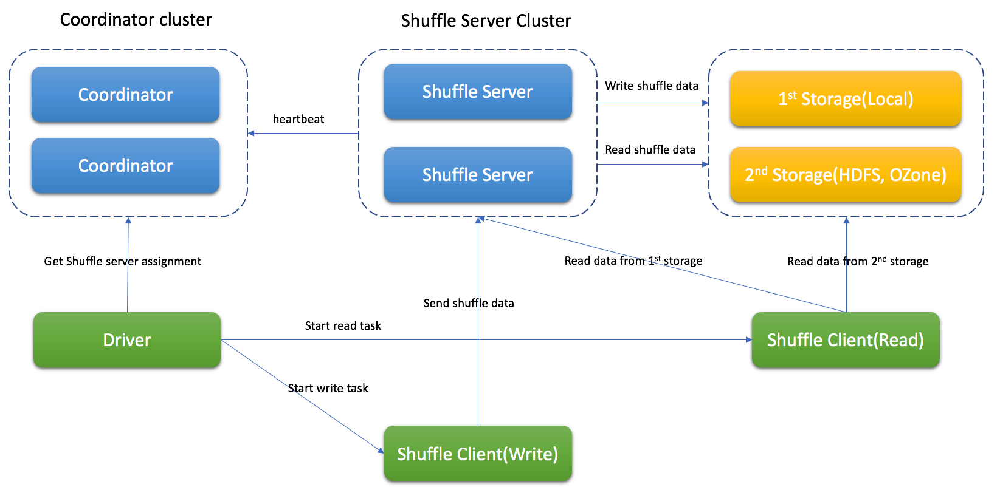
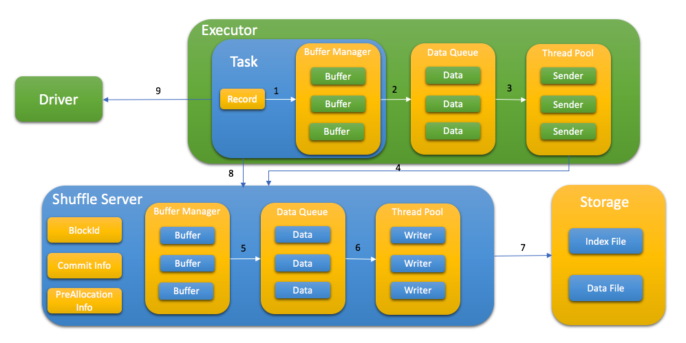

# What is Firestorm

Firestorm is a Remote Shuffle Service, and provides the capability for Apache Spark applications
to store shuffle data on remote servers.

## Architecture

Firestorm contains coordinator cluster, shuffle server cluster and remote storage(eg, HDFS) if necessary.

Coordinator will collect status of shuffle server and do the assignment for the job.

Shuffle server will receive the shuffle data, merge them and write to storage.

Depend on different situation, Firestorm supports Memory & Local, Memory & Remote Storage(eg, HDFS), Local only, Remote Storage only.

## Shuffle Process with Firestorm

* Spark driver ask coordinator to get shuffle server for shuffle process
* Spark task write shuffle data to shuffle server with following step:

   1. Send KV data to buffer
   2. Flush buffer to queue when buffer is full or buffer manager is full
   3. Thread pool get data from queue
   4. Request memory from shuffle server first and send the shuffle data
   5. Shuffle server cache data in memory first and flush to queue when buffer manager is full
   6. Thread pool get data from queue
   7. Write data to storage with index file and data file
   8. After write data, task report all blockId to shuffle server, this step is used for data validation later
   9. Store taskAttemptId in MapStatus to support Spark speculation

* Depend on different storage type, spark task read shuffle data from shuffle server or remote storage or both of them.

## Shuffle file format
The shuffle data is stored with index file and data file. Data file has all blocks for specific partition and index file has metadata for every block.


## Supported Spark Version
Current support Spark 2.3.x, Spark 2.4.x, Spark3.0.x, Spark 3.1.x

Note: To support dynamic allocation, the patch(which is included in client-spark/patch folder) should be applied to Spark

## Building Firestorm

Firestorm is built using [Apache Maven](https://maven.apache.org/).
To build it, run:

    mvn -DskipTests clean package

To package the Firestorm, run:

    ./build_distribution.sh

rss-xxx.tgz will be generated for deployment

## Deploy

### Deploy Coordinator

1. unzip package to RSS_HOME
2. update RSS_HOME/bin/rss-env.sh, eg,
   ```
     JAVA_HOME=<java_home>
     HADOOP_HOME=<hadoop home>
     XMX_SIZE="16g"
   ```
3. update RSS_HOME/conf/coordinator.conf, eg,
   ```
     rss.rpc.server.port 19999
     rss.jetty.http.port 19998
     rss.coordinator.server.heartbeat.timeout 30000
     rss.coordinator.app.expired 60000
     rss.coordinator.shuffle.nodes.max 5
     rss.coordinator.exclude.nodes.file.path RSS_HOME/conf/exclude_nodes
   ```
4. start Coordinator
   ```
    bash RSS_HOME/bin/start-coordnator.sh
   ```

### Deploy Shuffle Server

1. unzip package to RSS_HOME
2. update RSS_HOME/bin/rss-env.sh, eg,
   ```
     JAVA_HOME=<java_home>
     HADOOP_HOME=<hadoop home>
     XMX_SIZE="80g"
   ```
3. update RSS_HOME/conf/server.conf, the following demo is for local storage only, eg,
   ```
     rss.rpc.server.port 19999
     rss.jetty.http.port 19998
     rss.rpc.executor.size 2000
     rss.storage.type LOCALFILE
     rss.coordinator.quorum <coordinatorIp1>:19999,<coordinatorIp2>:19999
     rss.storage.basePath /data1/rssdata,/data2/rssdata....
     rss.server.flush.thread.alive 5
     rss.server.flush.threadPool.size 10
     rss.server.buffer.capacity 40g
     rss.server.read.buffer.capacity 20g
     rss.server.heartbeat.timeout 60000
     rss.server.heartbeat.interval 10000
     rss.rpc.message.max.size 1073741824
     rss.server.preAllocation.expired 120000
     rss.server.commit.timeout 600000
     rss.server.app.expired.withoutHeartbeat 120000
   ```
4. start Shuffle Server
   ```
    bash RSS_HOME/bin/start-shuffle-server.sh
   ```

### Deploy Spark Client
1. Add client jar to Spark classpath, eg, SPARK_HOME/jars/

   The jar for Spark2 is located in <RSS_HOME>/jars/client/spark2/rss-client-XXXXX-shaded.jar

   The jar for Spark3 is located in <RSS_HOME>/jars/client/spark3/rss-client-XXXXX-shaded.jar

2. Update Spark conf to enable Firestorm, the following demo is for local storage only, eg,

   ```
   spark.shuffle.manager org.apache.spark.shuffle.RssShuffleManager
   spark.rss.coordinator.quorum <coordinatorIp1>:19999,<coordinatorIp2>:19999
   spark.rss.storage.type MEMORY_LOCALFILE
   ```

### Support Spark dynamic allocation

To support spark dynamic allocation with Firestorm, spark code should be updated.
There are 2 patches for spark-2.4.6 and spark-3.1.2 in spark-patches folder for reference.

After apply the patch and rebuild spark, add following configuration in spark conf to enable dynamic allocation:
  ```
  spark.shuffle.service.enabled false
  spark.dynamicAllocation.enabled true
  ```


## Configuration

The important configuration is listed as following.

### Coordinator

|Property Name|Default|	Meaning|
|---|---|---|
|rss.coordinator.server.heartbeat.timeout|30000|Timeout if can't get heartbeat from shuffle server|
|rss.coordinator.assignment.strategy|BASIC|Strategy for assigning shuffle server, only BASIC support|
|rss.coordinator.app.expired|60000|Application expired time (ms), the heartbeat interval should be less than it|
|rss.coordinator.shuffle.nodes.max|9|The max number of shuffle server when do the assignment|
|rss.coordinator.exclude.nodes.file.path|-|The path of configuration file which have exclude nodes|
|rss.coordinator.exclude.nodes.check.interval.ms|60000|Update interval (ms) for exclude nodes|
|rss.rpc.server.port|-|RPC port for coordinator|
|rss.jetty.http.port|-|Http port for coordinator|

### Shuffle Server

|Property Name|Default|	Meaning|
|---|---|---|
|rss.coordinator.quorum|-|Coordinator quorum|
|rss.rpc.server.port|-|RPC port for Shuffle server|
|rss.jetty.http.port|-|Http port for Shuffle server|
|rss.server.buffer.capacity|-|Max memory of buffer manager for shuffle server|
|rss.server.memory.shuffle.highWaterMark.percentage|75.0|Threshold of spill data to storage, percentage of rss.server.buffer.capacity|
|rss.server.memory.shuffle.lowWaterMark.percentage|25.0|Threshold of keep data in memory, percentage of rss.server.buffer.capacity|
|rss.server.read.buffer.capacity|-|Max size of buffer for reading data|
|rss.server.heartbeat.interval|10000|Heartbeat interval to Coordinator (ms)|
|rss.server.flush.threadPool.size|10|Thread pool for flush data to file|
|rss.server.commit.timeout|600000|Timeout when commit shuffle data (ms)|
|rss.storage.type|-|Supports LOCALFILE, HDFS, LOCALFILE_AND_HDFS|

### Spark Client

|Property Name|Default|	Meaning|
|---|---|---|
|spark.rss.writer.buffer.size|3m|Buffer size for single partition data|
|spark.rss.writer.buffer.spill.size|128m|Buffer size for total partition data|
|spark.rss.coordinator.quorum|-|Coordinator quorum|
|spark.rss.storage.type|-|Supports MEMORY_LOCAL, MEMORY_HDFS, LOCALFILE, HDFS, LOCALFILE_AND_HDFS|
|spark.rss.client.send.size.limit|16m|The max data size sent to shuffle server|
|spark.rss.client.read.buffer.size|32m|The max data size read from storage|
|spark.rss.client.send.threadPool.size|10|The thread size for send shuffle data to shuffle server|


## LICENSE

Firestorm is under the Apache License Version 2.0. See the [LICENSE](https://github.com/Tencent/Firestorm/blob/master/LICENSE) file for details.

## Contributing
For more information about contributing issues or pull requests, see [Firestorm Contributing Guide](https://github.com/Tencent/Firestorm/blob/master/CONTRIBUTING.md).
