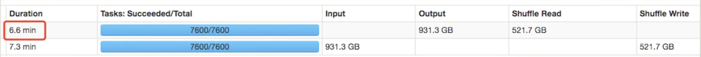
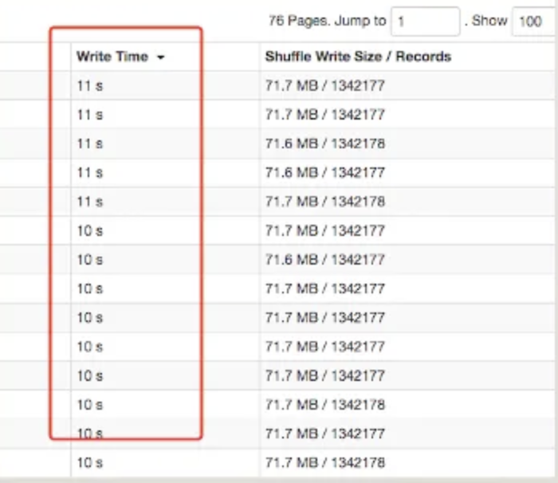
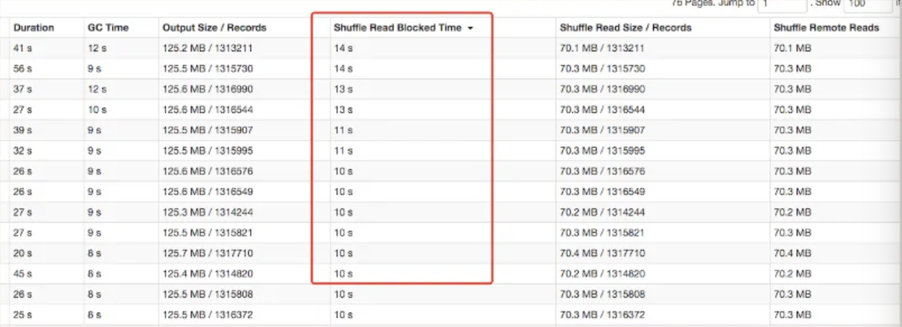
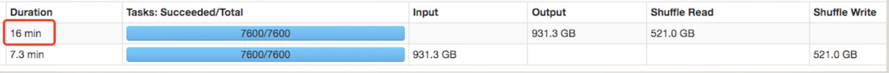
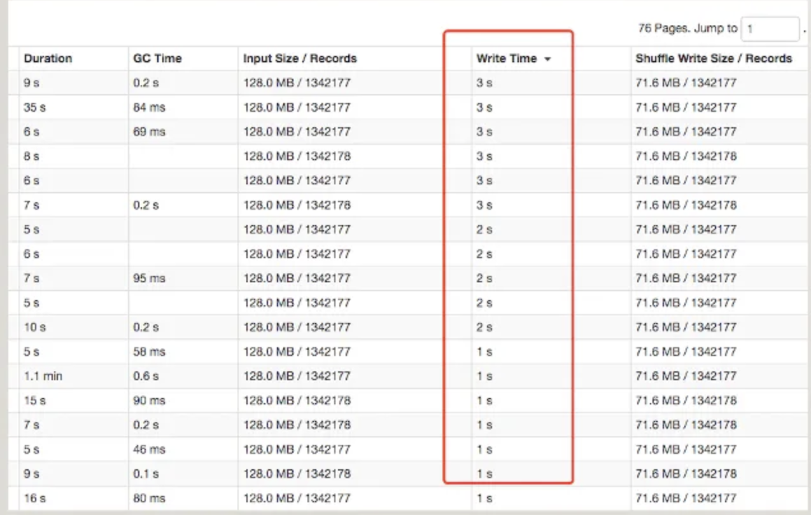
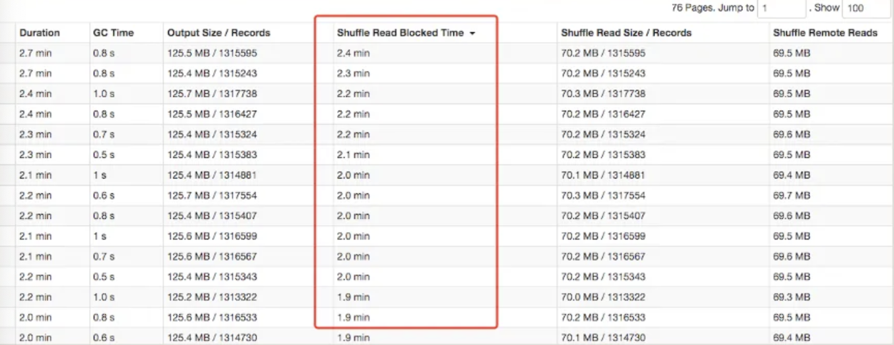

<!--
  ~ Licensed to the Apache Software Foundation (ASF) under one or more
  ~ contributor license agreements.  See the NOTICE file distributed with
  ~ this work for additional information regarding copyright ownership.
  ~ The ASF licenses this file to You under the Apache License, Version 2.0
  ~ (the "License"); you may not use this file except in compliance with
  ~ the License.  You may obtain a copy of the License at
  ~
  ~    http://www.apache.org/licenses/LICENSE-2.0
  ~
  ~ Unless required by applicable law or agreed to in writing, software
  ~ distributed under the License is distributed on an "AS IS" BASIS,
  ~ WITHOUT WARRANTIES OR CONDITIONS OF ANY KIND, either express or implied.
  ~ See the License for the specific language governing permissions and
  ~ limitations under the License.
  -->
  ## Environment
  
  Software: Uniffle 0.2.0  Hadoop 2.8.5 Spark 2.4.6
  
  Hardware: Machine 176 cores, 265G memory, 4T * 12 HDD, network bandwidth 10GB/s
  
  Hadoop Yarn Cluster: 1 * ResourceManager + 6 * NodeManager, every machine 4T * 10 HDD
  
  Uniffle Cluster: 1 * Coordinator + 6 * Shuffle Server, every machine 4T * 10 HDD
  
  ## Configuration
  Spark's configuration
  ````
  spark.executor.instances 100
  spark.executor.cores 4
  spark.executor.memory 9g
  spark.executor.memoryOverhead 1024
  spark.shuffle.manager org.apache.uniffle.spark.shuffle.RssShuffleManager
  spark.rss.storage.type MEMORY_LOCALFILE
  ````
  Shuffle Server's configuration
  ````
  rss.storage.type MEMORY_LOCALFILE
  rss.server.buffer.capacity 50g
  ````
  
  ## TPC-DS
  We used [spark-sql-perf](https://github.com/databricks/spark-sql-perf) to generate 1TB data.
  
  |query name|vanilla|uniffle|
  |---|---|---|
  |query1|16|18|
  |query10|30|35|
  |query11|86|96|
  |query12|14|17|
  |query13|102|77|
  |query14a|239|254|
  |query14b|226|232|
  |query15|44|48|
  |query16|50|59|
  |query17|83|97|
  |query18|31|35|
  |query19|15|17|
  |query2|21|25|
  |query20|15|16|
  |query21|8|8|
  |query22|21|22|
  |query23a|288|366|
  |query23b|366|422|
  |query24a|181|198|
  |query24b|167|187|
  |query25|93|113|
  |query26|15|15|
  |query27|16|17|
  |query28|38|41|
  |query29|80|102|
  |query3|9|11|
  |query30|21|26|
  |query31|30|40|
  |query32|14|15|
  |query33|26|30|
  |query34|12|16|
  |query35|34|39|
  |query36|15|18|
  |query37|16|20|
  |query38|27|36|
  |query39|15|19|
  |query39a|16|20|
  |query39b|14|19|
  |query4|205|227|
  |query40|38|38|
  |query41|5|6|
  |query42|9|10|
  |query43|13|13|
  |query44|20|22|
  |query45|30|36|
  |query46|16|18|
  |query47|22|25|
  |query48|25|24|
  |query49|58|66|
  |query5|56|59|
  |query50|56|61|
  |query51|23|28|
  |query52|9|10|
  |query53|12|13|
  |query54|52|62|
  |query55|9|10|
  |query56|25|27|
  |query57|20|22|
  |query58|23|26|
  |query59|22|22|
  |query6|33|41|
  |query60|25|28|
  |query61|25|28|
  |query62|10|11|
  |query63|12|12|
  |query64|176|185|
  |query65|32|37|
  |query66|23|24|
  |query67|697|775|
  |query68|17|19|
  |query69|31|34|
  |query7|17|17|
  |query70|24|27|
  |query71|23|24|
  |query72|335|350|
  |query73|12|14|
  |query74|68|99|
  |query75|58|67|
  |query76|21|21|
  |query77|35|37|
  |query78|151|169|
  |query79|16|16|
  |query8|15|20|
  |query80|146|163|
  |query81|18|26|
  |query82|28|31|
  |query83|21|24|
  |query84|16|19|
  |query85|45|49|
  |query86|14|17|
  |query87|29|37|
  |query88|29|29|
  |query89|11|13|
  |query9|37|37|
  |query90|11|11|
  |query91|17|21|
  |query92|12|12|
  |query93|86|86|
  |query94|40|42|
  |query95|94|94|
  |query96|10|10|
  |query97|29|34|
  |query98|17|21|
  |query99|13|12|
  |total|5821|6494|
  
  Uniffle is a little 9% slower than vanilla Spark. Because the amount of shuffle is tiny.
  
  ## Tera Sort
  We generate 1TB data, we use the code of the [repo](https://github.com/ehiggs/spark-terasort)
  #### Uniffle performance
  Overall Time:
  
  Write Time:
  
  Read Time:
  
  #### vanilla Spark performance
  Overall Time:
  
  Write Time:
  
  Read Time:
  
  Uniffle is 30%+ much faster than vanilla Spark when there is a large shuffle.
  
  
  
  