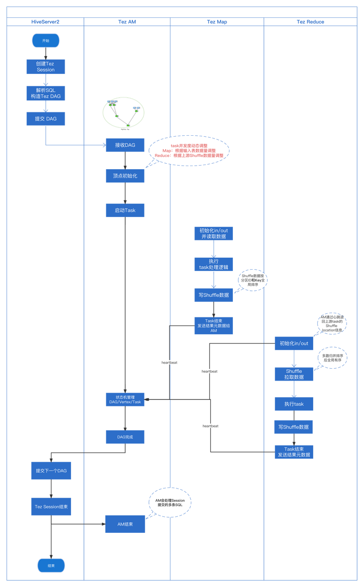
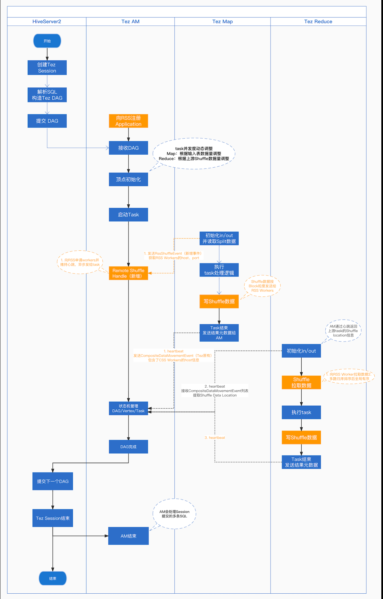

# Design of Tez Client on RSS
This document describes the design and implementation of the Tez Client on RSS.

## Rationale for Designing the Tez Client
Currently, Uniffle supports Spark and MR clients, but does not support Tez. 
Given that Tez is also widely used, we decided to design a client-tez module and implement its functionality.

## Implementation of the Tez Client
Before delving into the design, let's first understand the local Tez shuffle:

From the flow diagram, we can see that the reduce task gets the upstream task information through a heartbeat. And some other obvious information.

Based on this, we designed the following modifications:

1. Modify the application master to register with the coordinator, obtain worker information, and send this information to the map task and reduce task.

2. Modify Shuffle Read to send requests to the AM to get worker information. The main modification is to write shuffle data to workers. After successful writing, send an event to the AM about partition information.

3. Modify Shuffle Write to get upstream shuffle worker location by send request to AM. The main modification is to read shuffle data from the worker.

To summarize the above modification points, we have drawn the following RSS flowchart:

### Tez Shuffle AM design
This section describe the AM design detail.

Introduce RssDagAppMaster and extend DAGAppMaster to implement the following functions:
1. Register an Application with RSS
2. Start TezRemoteShuffleManager to send response of shuffle worker request.
3. Start a heartbeat thread to send heartbeats to the coordinator.

### Shuffle Write Module
1. Add a new class, RssOrderedPartitionedKVOutput, similar to the original OrderedPartitionedKVOutput, responsible for ordered shuffle write. 
Add RssUnorderedKVOutput, similar to the original UnorderedKVOutput, responsible for unordered shuffle write. 
This is the entry point to implement the shuffle write logic.
2. Add new logic to request for workers.
3. **The main change is to send shuffle data blocks to workers.**

### Shuffle Read Module
1. Like the Shuffle Write Module, add a new class, RssOrderedGroupedKVInput, similar to the original OrderedGroupedKVInput, responsible for ordered shuffle read. 
Add RssUnorderedKVInput, similar to the original UnorderedKVInput, responsible for unordered shuffle read. 
This is the entry point to implement the shuffle read logic.
2. Also add new logic to request for workers.
3. **The main change is to read shuffle data blocks from workers.** 

