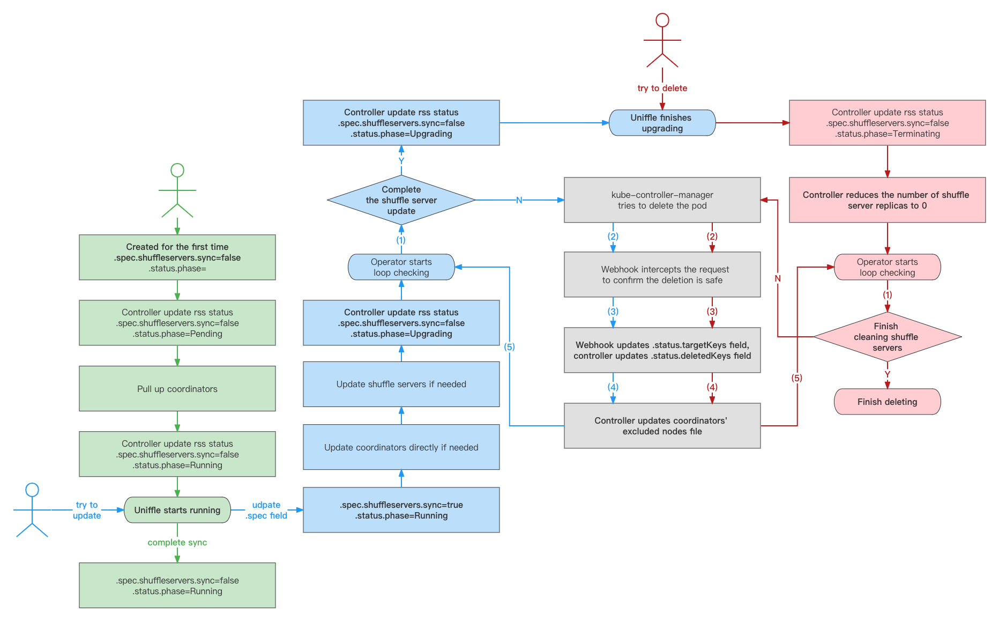

<!--
  ~ Licensed to the Apache Software Foundation (ASF) under one or more
  ~ contributor license agreements.  See the NOTICE file distributed with
  ~ this work for additional information regarding copyright ownership.
  ~ The ASF licenses this file to You under the Apache License, Version 2.0
  ~ (the "License"); you may not use this file except in compliance with
  ~ the License.  You may obtain a copy of the License at
  ~
  ~    http://www.apache.org/licenses/LICENSE-2.0
  ~
  ~ Unless required by applicable law or agreed to in writing, software
  ~ distributed under the License is distributed on an "AS IS" BASIS,
  ~ WITHOUT WARRANTIES OR CONDITIONS OF ANY KIND, either express or implied.
  ~ See the License for the specific language governing permissions and
  ~ limitations under the License.
  -->

# Uniffle Operator Design

## Summary

The purpose is to develop an operator to facilitate the rapid deployment of Uniffle in kubernetes environments.

## Motivation

Using the advantages of kubernetes in container orchestration, elastic scaling, and rolling upgrades, uniffle can more
easily manage coordinator and shuffle server clusters.

In addition, based on the operating characteristics of shuffle servers, we hope to achieve safe offline:

1. Before a shuffle server is scaled down or upgraded, it should be added to the Coordinator's blacklist in advance.
2. After ensuring that the number of remaining applications is 0, allow its corresponding pod to be deleted and removed
   from the blacklist.

We don't just want to simply pull up the coordinators and shuffle servers, but also ensure that running jobs are not
affected. Therefore, we decided to develop an operator specifically.

## Goals

Operator will implement the following functions:

1. Normally pull up two coordinator deployments (to ensure active-active) and a shuffle server statefulSet.
2. Supports replica expansion and upgrade of coordinators and shuffle servers, among which shuffle server also supports
   grayscale upgrade.
3. Using the webhook mechanism, before a shuffle server is deleted, add its name to the coordinator's blacklist, and
   check the number of applications remaining running, and then release the pod deletion request after ensuring safety.

## Design Details

This operator consists of two components: a crd controller and a webhook that admits crd and pod requests.

The crd controller observes the status changes of the crd and controls the workload changes.

The webhook verifies the changes of the crd, and admits the pod deletion request according to whether the number of
remaining applications is 0.

The webhook will add the pod to be deleted to the coordinator's blacklist. When the pod is actually deleted, the
controller will remove it from the blacklist.

## CRD Definition

An example of a crd object is as follows：

```yaml
apiVersion: uniffle.apache.org/v1alpha1
kind: RemoteShuffleService
metadata:
  name: rss-demo
  namespace: kube-system
spec:
  # ConfigMapName indicates configMap name stores configurations of coordinators and shuffle servers.
  configMapName: rss-demo
  # Coordinator represents the relevant configuration of the coordinators.
  coordinator:
    # Image represents the mirror image used by coordinators.
    image: ${coordinator-image}
    # InitContainerImage is optional, mainly for non-root users to initialize host path permissions.
    initContainerImage: "busybox:latest"
    # Count is the number of coordinator workloads to be generated.
    # By default, we will deploy two coordinators to ensure active-active.
    count: 2
    # RpcNodePort represents the port required by the rpc protocol of the coordinators,
    # and the range is the same as the port range of the NodePort type service in kubernetes.
    # By default, we will deploy two coordinators to ensure active-active.
    rpcNodePort:
      - 30001
      - 30011
    # httpNodePort represents the port required by the http protocol of the coordinators,
    # and the range is the same as the port range of the NodePort type service in kubernetes.
    # By default, we will deploy two coordinators to ensure active-active.
    httpNodePort:
      - 30002
      - 30012
    # XmxSize indicates the xmx size configured for coordinators.
    xmxSize: "10G"
    # ConfigDir records the directory where the configuration of coordinators reside.
    configDir: "/data/rssadmin/rss/conf"
    # Replicas field is the replicas of each coordinator's deployment.
    replicas: 1
    # ExcludeNodesFilePath indicates exclude nodes file path in coordinators' containers.
    excludeNodesFilePath: "/data/rssadmin/rss/coo/exclude_nodes"
    # SecurityContext holds pod-level security attributes and common container settings.
    securityContext:
      # RunAsUser specifies the user ID of all processes in coordinator pods.
      runAsUser: 1000
      # FsGroup specifies the group ID of the owner of the volume within coordinator pods.
      fsGroup: 1000
    # LogHostPath represents the host path used to save logs of coordinators.
    logHostPath: "/data/logs/rss"
    # HostPathMounts field indicates host path volumes and their mounting path within coordinators' containers.
    hostPathMounts:
      /data/logs/rss: /data/rssadmin/rss/logs
    volumeMounts:
      - name: hadoop-config
        mountPath: "/data/rssadmin/hadoop/conf"
        readOnly: true
    volumes:
       - name: hadoop-config
         configMap:
            name: hadoop-configuration
  # shuffleServer represents the relevant configuration of the shuffleServers
  shuffleServer:
    # Sync marks whether the shuffle server needs to be updated or restarted.
    # When the user needs to update the shuffle servers, it needs to be set to true.
    # After the update is successful, the controller will modify it to false.
    sync: true
    # Replicas field is the replicas of each coordinator's deployment.
    replicas: 3
    # Image represents the mirror image used by shuffle servers.
    image: ${shuffle-server-image}
    volumeMounts:
       - name: hadoop-config
         mountPath: "/data/rssadmin/hadoop/conf"
         readOnly: true
    volumes:
       - name: hadoop-config
         configMap:
            name: hadoop-configuration
```

After a user creates a rss object, the rss-controller component will create the corresponding workloads.

For coordinators, the user directly modifies the rss object, and the controller synchronizes the corresponding state to
the workloads.

For shuffle servers, only by changing the spec.shuffleServer.sync field to true, the controller will apply the
corresponding updates to the workloads.

If you want more examples, please read more in [examples](examples.md).

## State Transition


