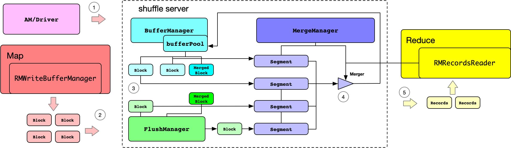

# remote merge guide

## Introduction

Map side generate shuffle file, which is set of key/value pairs that are sorted locally on the map side. 
Reduce side collects the shuffle files generated by the map side and then performs merge sort. 
If there are many shuffle data, reduce side does not have enough memory, so it needs to spill to disk.
But some rss jobs may run on low-storage machines, and we want to avoid using local disk as much as possible. 
There are two ways to solve this problem:

* Spill to merged data to remote file system.
* Merge on the shuffle server side.

Here we will describe merge on the shuffle server side.

## Architecture

Let's now determine what needs to be done on the shuffle server. Merge can be divided into two stages: sort and combine.
Sorting is based on the key comparator, and it is easy to identify the key comparator on the shuffle side. The combine 
function is often some user code, so it is difficult to execute on the shuffle server. Through the previous analysis,
we have made it clear that we need to sort by key on the server side. 
(Note: Perhaps it would be more appropriate to name this feature: `remote sort`)

The shuffle server has only one version of the instance, but the client can have multiple versions of the computing
framework. Each version of the computing framework use their own serializer. To avoid the impact of different versions,
this feature needs to use a unified serializer. In addition, different versions of the key and key comparator may also
be different, so the shuffle server supports specifying a classloader to load different versions of the key and key
comparator

Let's see the remote merge architecture:

The following introduces the process of Remote Merge:

* (1) register

When AM/Driver calls the `registerShuffle`, it will additionally register keyClass, valueClass and keyComparator. 
This information is mainly used by ShuffleServer to parse and sort the record during merging.

* (2) sendShuffleData

The `sendShuffleData` logic is basically consistent with existing rss job. The only difference is the use of unified
serializers and deserializers, which ensures that shuffle server can parse the record normally no matter which
framework it is.

* (3) buffer and flush

The shuffle server will store the data in the cache, or flush it to the local file system through the flush manager.
The logic of the original shuffle server is still reused here.

* (4) startSortMerge

A new api is provided: `startSortMerge`. Reduce end will deduplicate the blocks generated by the map, and then send
the valid block set to ShuffleServer through `startSortMerge`. After shuffle server receives a valid blocks collection,
it will trigger merge. The results of merge will be written to the bufferPool like a normal block, and may be flushed
to disk when necessary. The result generated by merge is an ordinary block, but for convenience of explanation, it is 
called merged block here, and store in new appId, which is the original appId with the @RemoteMerge suffix. The merged
block records the results sorted by key, so when reading the merged block, you need to read it in ascending order in the
order of blockid.

* (5) getSortedShuffleData

Here we introduce a new api dedicated to reading merged blocks: `getSortedShuffleData`. Reduce will read merged blocks
in the order of block serial numbers, and then choose when to use them for reduce calculations based on certain 
conditions.

## Configuration

### Server settings

| Property Name                                | Default           | 	Description                                                                                                                                                                                                                                                                                      |
|----------------------------------------------|-------------------|---------------------------------------------------------------------------------------------------------------------------------------------------------------------------------------------------------------------------------------------------------------------------------------------------|
| rss.server.merge.enable                      | false             | Whether to enable remote merge in server side.                                                                                                                                                                                                                                                    |
| rss.server.merge.threadPoolSize              | 10                | The size for merge thread pool.                                                                                                                                                                                                                                                                   |
| rss.server.merge.threadPoolQueueSize         | Integer.MAX_VALUE | The size of waiting queue for merge thread pool.                                                                                                                                                                                                                                                  |
| rss.server.merge.threadAliveTime             | 120               | The thread idle time for merge thread pool (s).                                                                                                                                                                                                                                                   |
| rss.server.merge.defaultMergedBlockSize      | 14m               | The default merged block size.                                                                                                                                                                                                                                                                    |
| rss.server.merge.cacheMergedBlockInitSleepMs | 100               | When caching merged block, the minimum sleep time after failure to require memory.                                                                                                                                                                                                                |
| rss.server.merge.cacheMergedBlockMaxSleepMs  | 2000              | When caching merged block, the maximum sleep time after failure to require memory.                                                                                                                                                                                                                |
| rss.server.merge.blockRingBufferSize         | 2                 | A flush file contains multiple blocks. To avoid allocating handle for each block, the server reads the file sequentially and writes to ring buffer to cache the blocks. This configuration is used to set the size of the ring buffer.                                                            |
| rss.server.merge.classLoaderJarsPath         | null              | The jars path for class loader when merge. The value of rss.server.merge.classLoaderJarsPath is the default config for loading. You can also set rss.server.merge.classLoaderJarsPath.{label} to set different types of jar paths. The client can select different jar paths by specifying label. |

### Client settings

| Property Name                                                    | Default | 	Description                                                                                                                                                                                                                |
|------------------------------------------------------------------|---------|--------------------------------------------------------------------------------------------------------------------------------------------------------------------------------------------------------------------------------|
| <client_type>.rss.remote.merge.enable                            | false   | Whether to enable remote merge in client side.                                                                                                                                                                                 |
| <client_type>.rss.merged.block.size                              | -1      | The client specifies the size of the merged block. If not set, the value of rss.server.merge.defaultMergedBlockSize on the server will be used.                                                                                |
| <client_type>.rss.remote.merge.classloader                       | null    | The client selects the label of the jar path.                                                                                                                                                                                  |
| <client_type>.rss.client.remote.merge.fetch.initSleepMs          | 100     | The shuffle side supports merging and reading at the same time. The merged block to be obtained may not have been merged yet. Therefore, sleep is required. This value is the minimum sleep time.                              |
| <client_type>.rss.client.remote.merge.fetch.maxSleepMs           | 5000    | The shuffle side supports merging and reading at the same time. The merged block to be obtained may not have been merged yet. Therefore, sleep is required. This value is the maximum sleep time.                              |
| <client_type>.rss.client.remote.merge.reader.maxBuffer           | 2       | After the client obtains the sorted key/value pairs, it will be placed in the buffer for processing. This configuration controls the maximum number of buffers under each partition.                                           |
| <client_type>.rss.client.remote.merge.reader.maxRecordsPerBuffer | 500     | After the client obtains the sorted key/value pairs, it will be placed in the buffer for processing. When the RecordBuffer reaches the size specified by this configuration, it will be sent to the downstream for processing. |

### MapReduce settings

MapReduce requires additional configuration:

| Property Name                                                    | Value                                                |
|------------------------------------------------------------------|------------------------------------------------------|
| mapreduce.job.map.output.collector.class                         | org.apache.hadoop.mapred.RssMapOutputCollector       |
| mapreduce.job.reduce.shuffle.consumer.plugin.class               | org.apache.hadoop.mapreduce.task.reduce.RMRssShuffle |
