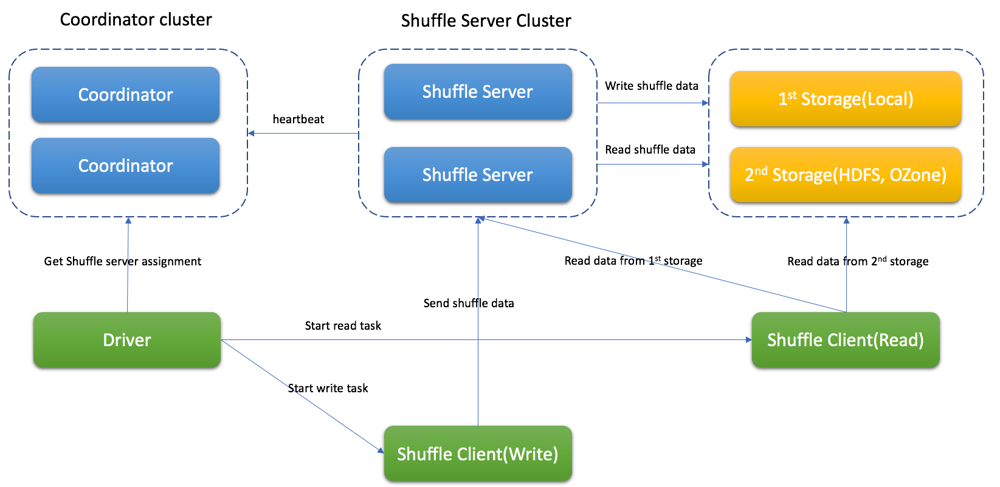
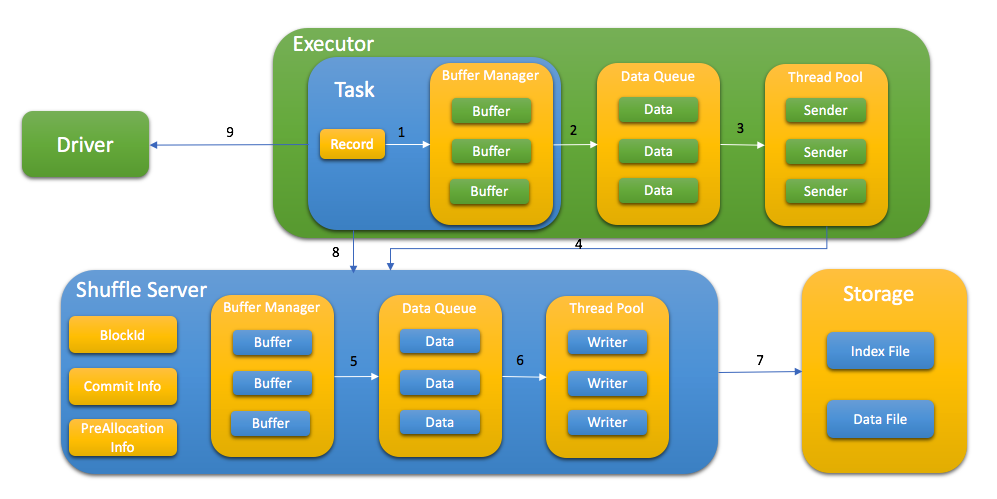

<!--
  ~ Licensed to the Apache Software Foundation (ASF) under one or more
  ~ contributor license agreements.  See the NOTICE file distributed with
  ~ this work for additional information regarding copyright ownership.
  ~ The ASF licenses this file to You under the Apache License, Version 2.0
  ~ (the "License"); you may not use this file except in compliance with
  ~ the License.  You may obtain a copy of the License at
  ~
  ~    http://www.apache.org/licenses/LICENSE-2.0
  ~
  ~ Unless required by applicable law or agreed to in writing, software
  ~ distributed under the License is distributed on an "AS IS" BASIS,
  ~ WITHOUT WARRANTIES OR CONDITIONS OF ANY KIND, either express or implied.
  ~ See the License for the specific language governing permissions and
  ~ limitations under the License.
  -->

# What is Uniffle

Uniffle is a Remote Shuffle Service, and provides the capability for Apache Spark applications
to store shuffle data on remote servers.

[](https://github.com/apache/incubator-uniffle/actions/workflows/build.yml)
[](https://codecov.io/gh/apache/incubator-uniffle)

## Architecture

Uniffle contains coordinator cluster, shuffle server cluster and remote storage(eg, HDFS) if necessary.

Coordinator will collect status of shuffle server and do the assignment for the job.

Shuffle server will receive the shuffle data, merge them and write to storage.

Depend on different situation, Uniffle supports Memory & Local, Memory & Remote Storage(eg, HDFS), Memory & Local & Remote Storage(recommendation for production environment).

## Shuffle Process with Uniffle

* Spark driver ask coordinator to get shuffle server for shuffle process
* Spark task write shuffle data to shuffle server with following step:

   1. Send KV data to buffer
   2. Flush buffer to queue when buffer is full or buffer manager is full
   3. Thread pool get data from queue
   4. Request memory from shuffle server first and send the shuffle data
   5. Shuffle server cache data in memory first and flush to queue when buffer manager is full
   6. Thread pool get data from queue
   7. Write data to storage with index file and data file
   8. After write data, task report all blockId to shuffle server, this step is used for data validation later
   9. Store taskAttemptId in MapStatus to support Spark speculation

* Depend on different storage type, spark task read shuffle data from shuffle server or remote storage or both of them.

## Shuffle file format
The shuffle data is stored with index file and data file. Data file has all blocks for specific partition and index file has metadata for every block.


## Supported Spark Version
Current support Spark 2.3.x, Spark 2.4.x, Spark3.0.x, Spark 3.1.x, Spark 3.2.x

Note: To support dynamic allocation, the patch(which is included in client-spark/patch folder) should be applied to Spark

## Supported MapReduce Version
Current support Hadoop 2.8.5's MapReduce framework.

## Building Uniffle
> note: currently Uniffle requires JDK 1.8 to build, adding later JDK support is on our roadmap.

Uniffle is built using [Apache Maven](https://maven.apache.org/).
To build it, run:

    mvn -DskipTests clean package

Build against profile Spark2(2.4.6)

    mvn -DskipTests clean package -Pspark2

Build against profile Spark3(3.1.2)

    mvn -DskipTests clean package -Pspark3

Build against Spark 3.2.x

    mvn -DskipTests clean package -Pspark3.2

To package the Uniffle, run:

    ./build_distribution.sh

Package against Spark 3.2.x, run:

    ./build_distribution.sh --spark3-profile 'spark3.2'

rss-xxx.tgz will be generated for deployment

## Deploy

### Deploy Coordinator

1. unzip package to RSS_HOME
2. update RSS_HOME/bin/rss-env.sh, eg,
   ```
     JAVA_HOME=<java_home>
     HADOOP_HOME=<hadoop home>
     XMX_SIZE="16g"
   ```
3. update RSS_HOME/conf/coordinator.conf, eg,
   ```
     rss.rpc.server.port 19999
     rss.jetty.http.port 19998
     rss.coordinator.server.heartbeat.timeout 30000
     rss.coordinator.app.expired 60000
     rss.coordinator.shuffle.nodes.max 5
     # enable dynamicClientConf, and coordinator will be responsible for most of client conf
     rss.coordinator.dynamicClientConf.enabled true
     # config the path of client conf
     rss.coordinator.dynamicClientConf.path <RSS_HOME>/conf/dynamic_client.conf
     # config the path of excluded shuffle server
     rss.coordinator.exclude.nodes.file.path <RSS_HOME>/conf/exclude_nodes
   ```
4. update <RSS_HOME>/conf/dynamic_client.conf, rss client will get default conf from coordinator eg,
   ```
    # MEMORY_LOCALFILE_HDFS is recommandation for production environment
    rss.storage.type MEMORY_LOCALFILE_HDFS
    # multiple remote storages are supported, and client will get assignment from coordinator
    rss.coordinator.remote.storage.path hdfs://cluster1/path,hdfs://cluster2/path
    rss.writer.require.memory.retryMax 1200
    rss.client.retry.max 100
    rss.writer.send.check.timeout 600000
    rss.client.read.buffer.size 14m
   ```
5. start Coordinator
   ```
    bash RSS_HOME/bin/start-coordnator.sh
   ```

### Deploy Shuffle Server

1. unzip package to RSS_HOME
2. update RSS_HOME/bin/rss-env.sh, eg,
   ```
     JAVA_HOME=<java_home>
     HADOOP_HOME=<hadoop home>
     XMX_SIZE="80g"
   ```
3. update RSS_HOME/conf/server.conf, eg,
   ```
     rss.rpc.server.port 19999
     rss.jetty.http.port 19998
     rss.rpc.executor.size 2000
     # it should be configed the same as in coordinator
     rss.storage.type MEMORY_LOCALFILE_HDFS
     rss.coordinator.quorum <coordinatorIp1>:19999,<coordinatorIp2>:19999
     # local storage path for shuffle server
     rss.storage.basePath /data1/rssdata,/data2/rssdata....
     # it's better to config thread num according to local disk num
     rss.server.flush.thread.alive 5
     rss.server.flush.threadPool.size 10
     rss.server.buffer.capacity 40g
     rss.server.read.buffer.capacity 20g
     rss.server.heartbeat.timeout 60000
     rss.server.heartbeat.interval 10000
     rss.rpc.message.max.size 1073741824
     rss.server.preAllocation.expired 120000
     rss.server.commit.timeout 600000
     rss.server.app.expired.withoutHeartbeat 120000
     # note: the default value of rss.server.flush.cold.storage.threshold.size is 64m
     # there will be no data written to DFS if set it as 100g even rss.storage.type=MEMORY_LOCALFILE_HDFS
     # please set proper value if DFS is used, eg, 64m, 128m.
     rss.server.flush.cold.storage.threshold.size 100g
   ```
4. start Shuffle Server
   ```
    bash RSS_HOME/bin/start-shuffle-server.sh
   ```

### Deploy Spark Client
1. Add client jar to Spark classpath, eg, SPARK_HOME/jars/

   The jar for Spark2 is located in <RSS_HOME>/jars/client/spark2/rss-client-XXXXX-shaded.jar

   The jar for Spark3 is located in <RSS_HOME>/jars/client/spark3/rss-client-XXXXX-shaded.jar

2. Update Spark conf to enable Uniffle, eg,

   ```
   spark.shuffle.manager org.apache.spark.shuffle.RssShuffleManager
   spark.rss.coordinator.quorum <coordinatorIp1>:19999,<coordinatorIp2>:19999
   # Note: For Spark2, spark.sql.adaptive.enabled should be false because Spark2 doesn't support AQE.
   ```

### Support Spark dynamic allocation

To support spark dynamic allocation with Uniffle, spark code should be updated.
There are 3 patches for spark (2.4.6/3.1.2/3.2.1) in spark-patches folder for reference.

After apply the patch and rebuild spark, add following configuration in spark conf to enable dynamic allocation:
  ```
  spark.shuffle.service.enabled false
  spark.dynamicAllocation.enabled true
  ```

### Deploy MapReduce Client

1. Add client jar to the classpath of each NodeManager, e.g.,  /share/hadoop/mapreduce/

The jar for MapReduce is located in /jars/client/mr/rss-client-mr-XXXXX-shaded.jar

2. Update MapReduce conf to enable Uniffle, eg,

   ```
   -Dmapreduce.rss.coordinator.quorum=<coordinatorIp1>:19999,<coordinatorIp2>:19999
   -Dyarn.app.mapreduce.am.command-opts=org.apache.hadoop.mapreduce.v2.app.RssMRAppMaster
   -Dmapreduce.job.map.output.collector.class=org.apache.hadoop.mapred.RssMapOutputCollector
   -Dmapreduce.job.reduce.shuffle.consumer.plugin.class=org.apache.hadoop.mapreduce.task.reduce.RssShuffle
   ```
Note that the RssMRAppMaster will automatically disable slow start (i.e., `mapreduce.job.reduce.slowstart.completedmaps=1`)
and job recovery (i.e., `yarn.app.mapreduce.am.job.recovery.enable=false`)


## Configuration

The important configuration is listed as following.

### Coordinator

|Property Name|Default| Description|
|---|---|---|
|rss.coordinator.server.heartbeat.timeout|30000|Timeout if can't get heartbeat from shuffle server|
|rss.coordinator.assignment.strategy|PARTITION_BALANCE|Strategy for assigning shuffle server, PARTITION_BALANCE should be used for workload balance|
|rss.coordinator.app.expired|60000|Application expired time (ms), the heartbeat interval should be less than it|
|rss.coordinator.shuffle.nodes.max|9|The max number of shuffle server when do the assignment|
|rss.coordinator.dynamicClientConf.path|-|The path of configuration file which have default conf for rss client|
|rss.coordinator.exclude.nodes.file.path|-|The path of configuration file which have exclude nodes|
|rss.coordinator.exclude.nodes.check.interval.ms|60000|Update interval (ms) for exclude nodes|
|rss.rpc.server.port|-|RPC port for coordinator|
|rss.jetty.http.port|-|Http port for coordinator|

### Shuffle Server

|Property Name|Default|Description|
|---|---|---|
|rss.coordinator.quorum|-|Coordinator quorum|
|rss.rpc.server.port|-|RPC port for Shuffle server|
|rss.jetty.http.port|-|Http port for Shuffle server|
|rss.server.buffer.capacity|-|Max memory of buffer manager for shuffle server|
|rss.server.memory.shuffle.highWaterMark.percentage|75.0|Threshold of spill data to storage, percentage of rss.server.buffer.capacity|
|rss.server.memory.shuffle.lowWaterMark.percentage|25.0|Threshold of keep data in memory, percentage of rss.server.buffer.capacity|
|rss.server.read.buffer.capacity|-|Max size of buffer for reading data|
|rss.server.heartbeat.interval|10000|Heartbeat interval to Coordinator (ms)|
|rss.server.flush.threadPool.size|10|Thread pool for flush data to file|
|rss.server.commit.timeout|600000|Timeout when commit shuffle data (ms)|
|rss.storage.type|-|Supports MEMORY_LOCALFILE, MEMORY_HDFS, MEMORY_LOCALFILE_HDFS|
|rss.server.flush.cold.storage.threshold.size|64M| The threshold of data size for LOACALFILE and HDFS if MEMORY_LOCALFILE_HDFS is used|
|rss.server.tags|-|The comma-separated list of tags to indicate the shuffle server's attributes. It will be used as the assignment basis for the coordinator|

### Shuffle Client

For more details of advanced configuration, please see [Uniffle Shuffle Client Guide](https://github.com/apache/incubator-uniffle/blob/master/docs/client_guide.md).

## LICENSE

Uniffle is under the Apache License Version 2.0. See the [LICENSE](https://github.com/apache/incubator-uniffle/blob/master/LICENSE) file for details.

## Contributing
For more information about contributing issues or pull requests, see [Uniffle Contributing Guide](https://github.com/apache/incubator-uniffle/blob/master/CONTRIBUTING.md).